<!-- .slide: class="left m1-slide m1-slide--cover" -->
## M1 — Transformarea digitală a sănătății și a sistemului de sănătate în România

### Transformarea sistemului digital de sănătate și asistență medicală

Conținut conform **materialelor curriculare** publicate în **platforma de e-learning SRIM** (Societatea Română de Informatică Medicală).

Note:
Conținut aliniat materialelor oficiale SRIM pentru M1.

---

<!-- .slide: class="left m1-slide m1-slide--video" -->
## Introducere

<iframe src="https://share.synthesia.io/embeds/videos/f382a632-f540-493f-9c4c-51ee4649f10c" loading="lazy" title="Modulul 1 — Introducere (video)" allowfullscreen allow="encrypted-media; fullscreen; microphone; screen-wake-lock;"></iframe>

---

<!-- .slide: class="left m1-slide" -->
## Conformitate și autoritate documentară

Această prezentare **sintetizează** informațiile din **documentele curriculare** și din **platforma de e-learning SRIM**, pentru uz didactic.

**În caz de neconcordanță** între această prezentare și **documentele oficiale** ale curriculumului sau **versiunile actualizate** din platformă, **prevală documentul sursă** publicat de titularii de conținut și de SRIM.

Respectarea **proprietății intelectuale** și a **politicilor** platformei este obligatorie în activitățile de formare.

---

<!-- .slide: class="left m1-slide" -->
## Comunitatea de învățare (platformă)

**Bine ai venit în comunitatea de învățare** a transformării digitale a sănătății și a sistemului de sănătate în România.

Acest forum este un spațiu dedicat **întrebărilor**, **explorării**, **sprijinului reciproc** și **dezvoltării împreună**.

*(Formulări reproduse din interfața cursului — materiale e-learning SRIM.)*

---

<!-- .slide: class="left m1-slide table-medium" -->
## Fișă modul — rezumat

| Tip | Conținut |
|-----|----------|
| **Titlu modul** | Transformarea sistemului digital de sănătate și asistență medicală |
| **Data** | 1 aprilie 2026 |
| **Public-țintă** | P1, P2, P3, P4 — toate profilurile |
| **Nivel competențe obiectiv** | De bază, intermediar |
| **Timp estimat** | 3–6 ore |
| **Livrare** | Asincron online, sincron online, în persoană, mixt |

---

<!-- .slide: class="left m1-slide" -->
## Preocupări (competențe) — coduri din cadru

**Secundare:** 3.1 Sisteme digitale clinice și de îngrijire · 3.2 Sisteme digitale operaționale și administrative · 4.1 Legislația privind datele medicale · 4.2 Standardele în materie de date privind sănătatea și interoperabilitatea · 5.1 Securitatea cibernetică și siguranța sistemului medical

*(Formulări înrudite în materialul modulului pentru competențe secundare.)*

---

<!-- .slide: class="left m1-slide" -->
## Context România — date macro

România are o populație de **19 milioane** de locuitori, cu tendință descrescătoare datorată îmbătrânirii (**20%** peste 65 de ani) și emigrării. Membră UE din **2007**. PIB pe cap de locuitor în **2023** (**29,7** mii EUR) sub media europeană (**38,1** mii EUR); tendință de convergență progresivă cu UE.

Pentru România, ca pentru restul UE, transformarea digitală în sănătate s-a impus ca **axă strategică** pentru accesibilitate, calitate, siguranța pacienților și eficiență; converge cu **reforma sectorului public**, **finanțarea europeană** și reglementarea datelor în sănătate.

---

<!-- .slide: class="left m1-slide" -->
## Obiectivele modulului

<ol class="m1-obj">
<li>Să <strong>delimitați</strong> cadrul strategic și de reglementare care condiționează sănătatea digitală.</li>
<li>Să <strong>sintetizați</strong> un diagnostic al sistemului de sănătate și al infrastructurii sale digitale.</li>
<li>Să <strong>propuneți</strong> o agendă digitală cu etape, guvernanță și implicații pentru dezvoltarea competențelor.</li>
</ol>

În secțiunile următoare ale materialului sunt analizate starea sistemului și transformarea digitală, integrând **ODD, OMS, EHDS** cu **diagnostic comparativ** și **agendă** propusă. Sunt analizate **PIAS (SIUI, SIPE, CEAS și DES)** și limitările privind **interoperabilitatea clinică longitudinală**, **standardizarea** și **guvernanța semantică**.

---

<!-- .slide: class="left m1-slide m1-slide--dense" -->
## Sinteză analiză și foaie de parcurs

Analiza sintetizează provocările profesioniștilor: **interoperabilitate**, **securitate cibernetică**, **alfabetizare digitală și gestionarea schimbărilor**, **modelul de accesibilitate și îngrijire**, **guvernanța**.

Se propune o **foaie de parcurs 2026–2031** în **trei etape**: **fundații**; **servicii și procese**; **valoare și scalare**. Se propun **model de guvernanță** și **plan de formare pe profiluri DigComp** pentru adoptare, calitatea datelor și sustenabilitate.

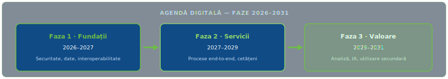
Figura 1 descrie fazele sintetice ale foii de parcurs digitale (2026–2031): fundații; servicii și procese; valoare și scalare.

---

<!-- .slide: class="left m1-slide m1-slide--dense" -->
## Metodologie și surse

Se efectuează analiza documentelor furnizate de **BOU** (descriptive), comparativ cu **surse instituționale europene și internaționale** (bibliografie) și documente tehnice pentru instruire.

Organizare: **(a)** sinteza contextului internațional și european; **(b)** descrierea sistemului de sănătate și arhitecturii digitale; **(c)** compararea indicatorilor agregați cu media UE; **(d)** identificarea provocărilor prioritare de către profesioniști.

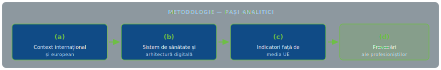
Figura 2 descrie pașii analitici (a)–(d) ai metodologiei modulului.

---

<!-- .slide: class="left m1-slide" -->
## Întrebări și domenii de aplicare

1. Ce **constrângeri** strategice și de reglementare (internaționale/UE) structurează transformarea digitală și formarea profesioniștilor din România?
2. Care este **starea** infrastructurii digitale și ce **limitări** împiedică schimbul clinic longitudinal și reutilizarea sigură a datelor?
3. Ce **priorități** rezultă din diagnostic și perspectiva profesioniștilor și cum se traduc într-o **foaie de parcurs** aplicabilă?
4. Ce **model de guvernanță** și ce **abordare de formare** sprijină adoptarea și calitatea datelor pe termen mediu?

---

<!-- .slide: class="left m1-slide" -->
## Limitări

Analiza utilizează **indicatori agregați și comparativi** și **nu înlocuiește** microevaluările din România (regiune, furnizor, proces clinic). Disponibilitatea și calitatea surselor secundare pot introduce **eterogenitate**.

**Recomandări:** audituri tehnice de interoperabilitate; evaluări ale maturității digitale pe centre; studii privind sarcina de îngrijire și fluxurile de lucru.

---

<!-- .slide: class="left m1-slide m1-slide--dense" -->
## Contextul dezvoltării curriculumului

Strategia competențelor digitale în sănătate în România este formulată în convergență cu **agendele globale (ODD)**, **recomandările OMS** și **obligațiile europene (EHDS)** — definind nevoi, competențe, drepturi, standarde de interoperabilitate, siguranță și criterii de evaluare.

La nivel național: aliniere la **transformarea digitală a sectorului public** și la **PNRR**, ca instrument de coerență pentru prioritizarea investițiilor și reformelor.

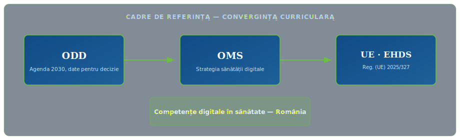
Figura 3 descrie convergența conceptuală între ODD, recomandările OMS și cadrul european (EHDS) pentru curriculum.

---

<!-- .slide: class="left m1-slide" -->
## ODD — sănătate și date pentru decizie

**ODD 3** ghidează statele spre reducerea mortalității evitabile, acoperire universală și urgențe sanitare. Din punct de vedere operațional, cadrul cere **informații fiabile și comparabile** pentru a monitoriza rezultatele și inegalitățile; strategia include **tablou de bord** cu indicatori aliniați standardelor internaționale și **responsabilitate**.

Întrebare din material: *cum este pusă în aplicare abordarea responsabilității și care sunt indicatorii-cheie pentru ODD 3?* — **„Vom putea aborda acest aspect în modulele 6, 7 și 8.”**

---

<!-- .slide: class="left m1-slide m1-slide--oms-strategy" -->
## OMS — Strategia globală privind sănătatea digitală (2020–2025)

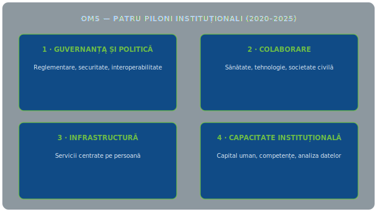
Figura 4 descrie cei patru piloni instituționali ai strategiei OMS privind sănătatea digitală (2020–2025).

OMS stabilește un cadru pentru adopție **etică, sigură și eficace** a sănătății digitale. Strategia identifică **patru piloni instituționali** (vezi **Figura 4**):

---

<!-- .slide: class="left m1-slide m1-slide--oms-pillars" -->
## OMS — Cei patru piloni instituționali

1. **Guvernanța și politica națională** — cadru de reglementare pentru inovare digitală, confidențialitate, securitate (interoperabilitate), încredere; legislație și leadership. *(Trimiteri module 3 și 6.)*
2. **Colaborare și alianțe strategice** — punți între sănătate, tehnologie, academic, societate civilă, telecomunicații; parteneriate esențiale. *(Module 4 și 5.)*
3. **Infrastructură și servicii centrate pe oameni** — conectivitate, sisteme interoperabile, servicii accesibile; atenție și alfabetizare. *(Module 4 și 5.)*
4. **Consolidarea capacității instituționale și a capitalului uman** — competențe digitale în forța de muncă și în analiza datelor pentru decizii bazate pe dovezi. *(Module 2, 4, 5 și 8.)*

---

<!-- .slide: class="left m1-slide m1-slide--dense" -->
## Uniunea Europeană — EHDS

**Regulamentul (UE) 2025/327** instituie **spațiul european al datelor privind sănătatea (EHDS)**, consolidând **accesul și portabilitatea** și obligațiile pentru utilizarea **primară și secundară** a datelor — categorii prioritare și **calendar progresiv** care condiționează planificarea națională.

Strategia încorporează orientări prin servicii de acces cetățenesc, interoperabilitate și competențe pentru utilizare secundară, inclusiv **HealthData@EU** [3].

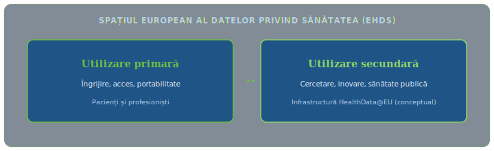
Figura 5 descrie distincția conceptuală între utilizarea primară și cea secundară a datelor în cadrul EHDS.

---

<!-- .slide: class="left m1-slide" -->
## DigComp — rol în strategie

**DigComp** este consolidat ca **standard** și **limbaj comun** pentru evaluare, planificare și politici de incluziune și dezvoltare durabilă în UE.

**Cinci domenii-cheie în material:** alfabetizarea în domeniul datelor; comunicarea; crearea de conținut; securitatea; soluționarea problemelor.

Cadrul competențelor digitale pentru profesioniștii din sănătate din România ia **DigComp ca referință** și este structurat, pe cât posibil, în consecință.

---

<!-- .slide: class="left m1-slide" -->
## Strategia națională de sănătate digitală — structură

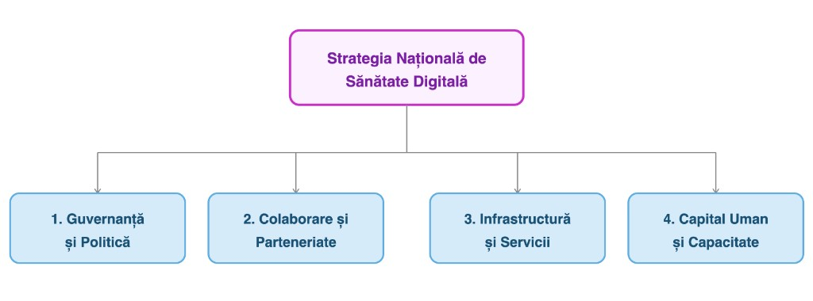
Figura 6 descrie structura pe patru domenii a Strategiei naționale de sănătate digitală (guvernanță; colaborare; infrastructură și servicii; capital uman și capacitate).

---

<!-- .slide: class="left m1-slide m1-slide--dense" -->
## Cadrul românesc al competențelor — sănătate digitală și date v2

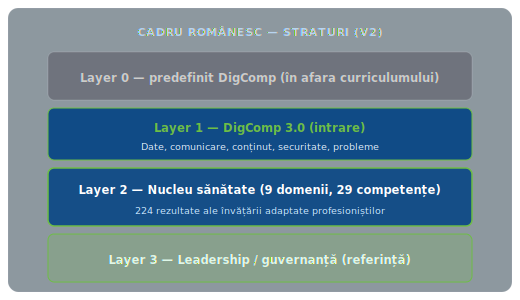
Figura 7 descrie stratificarea Layer 0–3 în cadrul românesc al competențelor (sănătate digitală și date, v2).

**Layer 0** — predefinit în DigComp: alfabetizare de bază, competențe numerice și profesionale generale; **nu sunt abordate** în acest curriculum.

**Layer 1** — **DigComp 3.0**: Informații și date, comunicare, crearea de conținut, securitate, rezolvarea problemelor; **cerință de intrare** pentru conținutul specific sănătății.

**Layer 2** — **nucleu:** **9 domenii**, **29 competențe**, **224 rezultate** ale învățării, adaptate profesioniștilor din sănătate.

**Layer 3** — leadership/guvernanță transformare digitală; **referință**; depășește aria unor module individuale.

---

<!-- .slide: class="left m1-slide" -->
## Rolul cadrelor și al formării

Modernizarea depinde mai mult de **competența digitală** și de **capacitatea organizațiilor** de a gestiona schimbarea decât de simpla disponibilitate a tehnologiei.

Sunt necesare **cadre de competențe** (model structurat) și **programe de dezvoltare** care cultivă cunoștințe, competențe și atitudini.

Scop: formare prin cunoștințe relevante, abilități practice la locul de muncă, valori și comportamente adecvate față de tehnologie.

---

<!-- .slide: class="left m1-slide table-mega" -->
## Tabelul 1 — Domenii 1–4
| Domeniu | Competențe (enumerare) |
|---------|-------------------------|
| **1. Gestionarea datelor și informațiilor** | Colectarea, înregistrarea și ștergerea datelor; Gestionare și prelucrare; Analiză și interpretare; Evaluare; Reutilizarea datelor în scopuri secundare; Calitatea și integritatea datelor |
| **2. Comunicare și colaborare** | Interacțiunea prin și cu tehnologiile digitale; Munca în echipă multidisciplinară și predarea digitală; Implicarea pacienților prin tehnologii digitale; Conduita digitală |
| **3. Tehnologie și conținut** | Sisteme digitale clinice și orientate spre îngrijire; Sisteme digitale operaționale și administrative; IA, sprijin decizional clinic și instrumente algoritmice; Instrumente de cercetare și practică bazate pe dovezi |
| **4. Legislație, standarde, licențe și drepturi de autor** | Legislația privind datele medicale; Standardele și interoperabilitatea datelor; Licențe și drepturi de autor |

---

<!-- .slide: class="left m1-slide table-mega" -->
## Tabelul 1 — Domenii 5–9
| Domeniu | Competențe (enumerare) |
|---------|-------------------------|
| **5. Siguranță și utilizare responsabilă** | Securitatea cibernetică și securitatea sistemelor clinice; Protecția datelor personale și a vieții private; Etica și cetățenia digitală |
| **6. Identificarea și rezolvarea problemelor / gândire critică** | Identificarea și rezolvarea problemelor tehnice; Identificarea nevoilor și soluții creative prin tehnologie digitală |
| **7. Echitate și bunăstare** | Echitate și incluziune; Bunăstare; Impactul tehnologiilor digitale asupra mediului |
| **8. Dezvoltare profesională** | Învățarea pe tot parcursul vieții și competențele digitale; Identitate digitală |
| **9. Transformarea digitală** | Transformarea digitală și macromediul; Conștientizarea proiectării și inovării centrate pe oameni |

---

<!-- .slide: class="left m1-slide m1-slide--figure m1-slide--figure-tall" -->
## Profil DigComp în sănătate

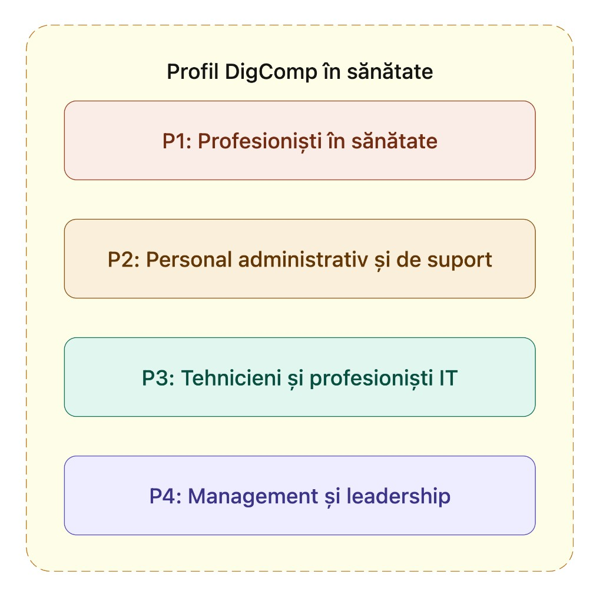
Figura 8 descrie profilurile DigComp în sănătate (P1–P4); detaliile sunt prezentate în Tabelul 2.

---

<!-- .slide: class="left m1-slide m1-slide--figure m1-slide--figure-tall" -->
## Profiluri — focus strategic / tehnologic / operațional / clinic

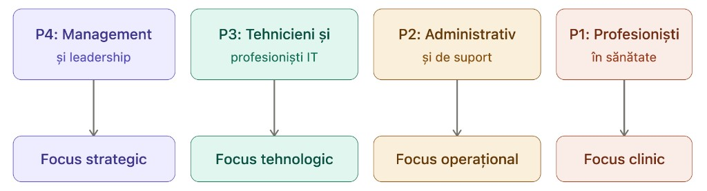
Figura 9 descrie profilele P1–P4 din perspectiva focusului strategic, tehnologic, operațional și clinic.

---

<!-- .slide: class="left m1-slide table-medium" -->
## Tabelul 2 — Profiluri profesionale
| Profil | Denumire | Descriere |
|--------|----------|-----------|
| **P1** | Îngrijirea directă a pacientului | Profesioniști cu asistență clinică directă: medici, asistente, moașe, științe sănătății |
| **P2** | Îngrijirea indirectă a pacienților | Sprijin fără contact principal cu pacientul: laborator, imagistică, farmacie, sănătate publică |
| **P3** | IT în sănătate și inovare digitală | Implementare, administrare, configurare, îmbunătățire sisteme digitale de sănătate; informatică clinică; manageri transformare digitală |
| **P4** | Administrare și management | Gestionare servicii, echipe, departamente, organizații; conducere și personal administrativ |

---

<!-- .slide: class="left m1-slide" -->
## Niveluri de competență (DigComp 3.0)

**De bază, Intermediar, Avansat, Foarte avansat** — fiecare nivel descrie ce ar trebui să știți și să puteți face, cu ce **autonomie** și **siguranță**.

*De bază:* sarcini simple, cu puțină sau fără supraveghere. *Intermediar:* autonomie mai mare, sarcini definite independent, început de rezolvare probleme fără sprijin extern. *Avansat:* situații complexe, adaptare. *Foarte avansat:* lider în domeniu, inovație, standarde — **pentru profiluri specializate**, nu pentru toți profesioniștii.

---

<!-- .slide: class="left m1-slide" -->
## Utilizarea cadrului în formare

**Evaluare inițială și finală** — referință pentru nivelul actual (diagnostic) și impactul formării (rezumativ).

**Traiectorii personalizate** — segmentare public, resurse diferențiate, timp investit în competențe relevante rolului.

**Alocarea resurselor** — optimizare formatori, instrumente, timp; dezvoltare **relevantă, funcțională**, aplicabilă practicii digitalizate.

Adoptarea cadrului este baza depășirii barierelor structurale din ecosistemul digital; apoi se analizează integrarea în **reforme și platforme** în curs.

---

<!-- .slide: class="left m1-slide m1-slide--pias-overview" -->
## Platforma IT a asigurărilor de sănătate — PIAS

**PIAS** — infrastructura digitală centrală a sistemului de asigurări sociale de sănătate gestionat de **CNAS**.

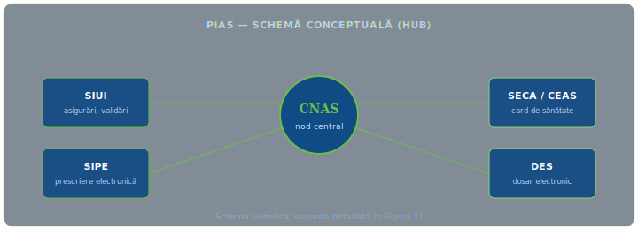
Figura 10 descrie schema conceptuală a platformei PIAS în jurul CNAS (SIUI, SIPE, SECA/CEAS, DES); reprezentarea detaliată este în Figura 11.

---

<!-- .slide: class="left m1-slide m1-slide--pias-official m1-slide--figure m1-slide--figure-tall" -->
## PIAS — componente și roluri (SIUI, SIPE, SECA, DES)

În enumerarea tehnică din materialul modulului: **(1) SIUI** — statut asigurat, validare servicii; **(2) SIPE** — prescripție electronică; **(3) SECA** — platformă electronică card asigurare; **(4) DES** — dosar electronic, istoric clinic. *(În fluxuri și figuri poate apărea și denumirea **CEAS** pentru cardul de sănătate — aceeași familie de componente PIAS.)*

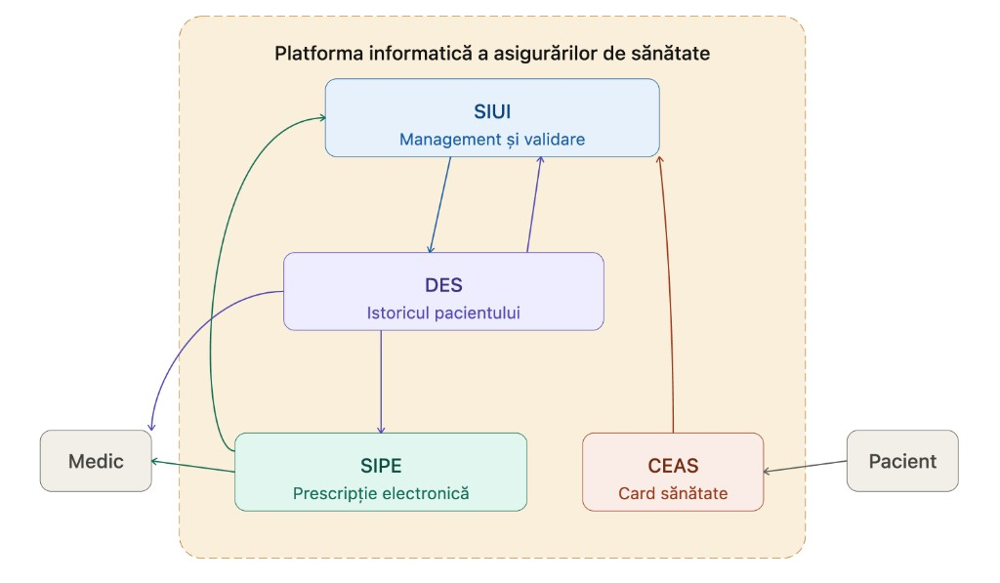
Figura 11 descrie platforma informatică a asigurărilor de sănătate și legătura dintre medic, pacient și componentele SIUI, DES, SIPE și CEAS.

---

<!-- .slide: class="left m1-slide" -->
## PIAS — integrare și limitări

Integrarea funcțională ar trebui să permită gestionarea unificată a **furnizării**, **finanțării** și **informațiilor clinice**.

În practică, platformele PIAS oferă adesea **trasabilitate administrativă** cu **limitări** pentru **schimbul clinic longitudinal** între niveluri — lipsă standarde comune, **guvernanță semantică** deficitară.

---

<!-- .slide: class="left m1-slide" -->
## Experiența altor țări

Randamentul investițiilor este maximizat prin **DES interoperabil longitudinal**, **servicii digitale pentru cetățeni** cu **autentificare solidă** și **reutilizare sigură** a datelor (sănătate publică, management, cercetare).

Rezultate limitate când digitalizarea rămâne la **raportare administrativă** fără **reproiectarea procesului clinic** sau **guvernanța datelor**.

---

<!-- .slide: class="left m1-slide" -->
## Context digital în sănătate — România

Sisteme centrale legate de asigurări (**SIUI**), modernizare spre **PIAS** — obiectiv: unifica înregistrări, prescripții electronice, trimiteri, documente clinice și administrative. Deficite de **standardizare**, **interoperabilitate** și schimb între furnizori.

Strategia națională de sănătate digitală sprijinită prin finanțare UE, **PNRR** — investiții sistem integrat e-sănătate, furnizori, sisteme telematice.

---

<!-- .slide: class="left m1-slide" -->
## Sectorul public și obiectivul digital 2030

Progrese la **identitate digitală**, platforme comune, servicii online; persistă provocări la **interoperabilitate** și **coordonare interinstituțională**.

În sănătate: autentificare în portaluri, schimb cu alte servicii publice, extindere infrastructură. *(Material: „Modulul 6 oferă indicii… pentru consolidarea acestor pași.”)*

**Planul național pentru deceniul digital** — transformare până în **2030**; sănătate digitală ca **axă verticală** cu cerințe sporite de securitate, continuitate și protecția datelor.

---

<!-- .slide: class="left m1-slide" -->
## PNRR și strategia sănătate–tehnologie–inovare

**PNRR** mobilizează investiții și reforme în digitalizare și sănătate — **prioritizare, secvențiere, coerență**, reutilizare active, reducere duplicări.

**Strategia României pentru sănătate, tehnologie și inovare** — priorități calitate, management, resurse umane; **centru digital** sănătate și date; măsurători **PREMs/PROMs**, audit calitate date, evaluare impact, scalare soluții bazate pe dovezi.

---

<!-- .slide: class="left m1-slide m1-slide--dense" -->
## Cadru conceptual

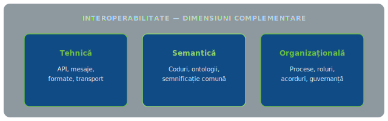
Figura 12 descrie cele trei dimensiuni ale interoperabilității: tehnică, semantică și organizațională.

Trei dimensiuni: **(i) Interoperabilitate** (tehnică, semantică, organizațională) — continuitate îngrijire; **(ii) Guvernanța datelor** — calitate, trasabilitate, viață privată, securitate, reutilizare legitimă; **(iii) Competențe digitale** — condiție pentru adoptare și valoare clinică și organizațională.

---

<!-- .slide: class="left m1-slide" -->
## Diagnostic — model instituțional și finanțare

Model **asigurări sociale de sănătate (SHI)** — contribuții obligatorii; **CNAS** administrează asigurări și servicii; **Ministerul Sănătății** — guvernanța sistemului.

În **2023**, fonduri publice ~**77%** din cheltuieli; restul privat, aproape tot **plăți directe** (ex. medicamente ambulatoriu, stomatologie) — **bariere de acces** pentru gospodării cu venituri mai mici. Asigurări private **marginale** [8,9].

---

<!-- .slide: class="left m1-slide" -->
## Indicatori — rol analitic

Indicatorii măsoară funcționarea sistemului, detectează probleme și fundamentează decizii — **acces, calitate, resurse, cheltuieli, eficiență, echitate**.

**Tabelul 3** (Eurostat / profil țară / Sănătatea pe scurt Europa) compară România cu media UE — surse citate în materialul de curs.

---

<!-- .slide: class="left m1-slide table-heavy" -->
## Tabelul 3 — România vs UE (I) (Eurostat)

| Zonă | Indicator | UE | România | Interpretare (material) |
|------|-----------|-----|---------|-------------------------|
| Rezultat | Mortalitate infantilă (la 1.000 născuți vii) | 3,5 (2024) | 6,6 (2024) | România ≈ dublu față de medie |
| Resurse | Paturi spital / 100.000 loc. | 511 (2023) | 728 (2023) | Peste medie UE (interpretare contextuală în sursă) |
| Resurse | Medici / 1.000 loc. | 4,3 (2023) | 3,7 | Sub medie |
| Resurse | Asistenți medicali / 1.000 loc. | 8,5 (2023) | 8,2 | Ușor sub medie |

---

<!-- .slide: class="left m1-slide table-heavy" -->
## Tabelul 3 — România vs UE (II)

| Zonă | Indicator | UE | România | Interpretare |
|------|-----------|-----|---------|--------------|
| Acces | Nevoi medicale nesatisfăcute (cost/timp/distanță) | 3,6% (2024, pop. în dificultate) | Diferență sărăcie/non-sărăcie: +10,7 pp | Echitate în acces |
| Finanțare | Cheltuieli sănătate % PIB | 10,0% (2023) | 5,7% (2023) | Sub medie UE |
| Demografie | Speranță viață la 65 ani | 20,2 ani (2024) | 15,5 ani (2023) | Diferență mare față de UE |
| Clinică | Speranță viață la naștere | 81,5 ani (2024) | 77 ani (2023) | Sub medie europeană |

Surse în material: *Sănătatea pe scurt: Europa 2024*; *România: Profilul de țară 2023*; Eurostat.

---

<!-- .slide: class="left m1-slide" -->
## Lecturi ale indicatorilor

Speranța de viață și la 65 ani: decalaje față de UE și față de țări cu longevitate ridicată (**7–8 ani**). Inegalități **rural–urban** (concentrare paturi și profesioniști urban). Paturi agregat peste medie UE; medici și asistenți sub medie — **nuantare** privind definiția paturilor între țări.

Acces și distribuție: nevoie de **întărire asistență medicală primară** ca poartă de intrare; **îngrijire ambulatorie**, digitalizare, automatizare fluxuri pot îmbunătăți rezultatele.

---

<!-- .slide: class="left m1-slide" -->
## Morbiditate, mortalitate evitabilă, cheltuieli, telemedicină

**Boli cardiovasculare și cancer** — cauze principale mortalitate (ex. 2022: CV **56%**, cancer **17%**). România: rate ridicate **mortalitate evitabilă/tratabilă** — marjă pentru prevenție primară, depistare, continuitate; **soluții digitale** pot contribui.

Cheltuieli **5,7% PIB** vs **~10%** UE — factor pentru rezultate și acces; factori de risc populaționali: fumat, alcool, sedentarism, vaccinare.

**Telemedicina** reglementată, dar necesită integrare cu **DES**, **prescripție electronică** și circuite între niveluri, nu canale izolate.

---

<!-- .slide: class="left m1-slide" -->
## Provocări prioritizate de profesioniști

Pe baza rapoartelor pentru modul:

- **Interoperabilitate și standarde** — fragmentare clinico-administrativă; lipsă cadru semantic comun.
- **Infrastructură eterogenă și securitate cibernetică** — maturitate inegală pe centre și regiuni.
- **Reziliență la schimbare și alfabetizare digitală** — rezistență la adopție; decalaj competențe profesioniști–pacienți.
- **Resurse și model de îngrijire** — deficit relativ profesioniști; orientare spital-centrică urbană.
- **Guvernanță** — suprapunere competențe; nevoie coordonare și responsabilitate.

---

<!-- .slide: class="left m1-slide" -->
## Agenda digitală pentru sănătate — elaborare

Concepută de **Ministerul Sănătății** prin **grup de lucru tehnic**, cu sprijin **OMS (Europa și biroul OMS România)**.

Prin **PNRR** și colaborare cu biroul OMS din România: strategie și plan de acțiune, instituții sănătate și digitalizare.

**Memorandum** OMS/Europa–Ministerul Sănătății: asistență tehnică, cadru PNRR, inclusiv sistem sigur **e-sănătate** și **telemedicină**.

Agendă = **reforme și proiecte congruente**; principii, obiective, linii strategice, domenii de intervenție, **indicatori** pentru monitorizare și decizii pe dovezi.

---

<!-- .slide: class="left m1-slide" -->
## Principii directoare

1. **Abordare centrată pe oameni și echitate** — servicii incluzive; reducere disparități teritoriale.
2. **Guvernanță, etică și responsabilitate** — confidențialitate și securitate date; trasparență și trasabilitate.
3. **Interoperabilitate, accesibilitate** — proiectare de la început; standarde, API-uri; guvernanță semantică.
4. **Co-creare și colaborare** — profesioniști și pacienți în conceperea soluțiilor.
5. **Inovare responsabilă și durabilitate** — evaluare riguroasă (clinic, etic, costuri, bias IA) înainte de scalare; TCO; continuitate servicii.

---

<!-- .slide: class="left m1-slide" -->
## Obiective strategice agregate

- **Oameni și sănătate** — accesibilitate, experiență, capacitare; drepturi date; reducere inegalități.
- **Procese de valoare** — reproiectare clinico-administrativă; **maximizare rezultate în raport cu resursele** (value-based care).
- **Informații interoperabile și de calitate** — date clinice longitudinale, de calitate, pentru îngrijire, management, sănătate publică.
- **Inovație și asistență 5P** — preventiv, predictiv, personalizat, participativ, populațional; analize, telemonitorizare, reutilizare sigură; modele predictive validate; prevenire personalizată cu măsurare impact.

---

<!-- .slide: class="left m1-slide" -->
## Implementare și plan de formare

Implementare în **etape consecutive**, transformare **graduală și sigură**, minimizând întreruperea serviciilor esențiale.

**Plan management instruire și schimbare:** competențe digitale minime personal medical și administrativ; competențe clinice digitale (interoperabilitate, prescriere sigură, documentație structurată, telemedicină integrată); capabilități avansate date și securitate în roluri specializate; adopție prin managementul schimbării (comunicare, leadership clinic, suport centre, măsurare utilizare și satisfacție).

---

<!-- .slide: class="left m1-slide table-heavy" -->
## Tabelul 4 — Foaie de parcurs 2026–2031
| Fază | Perioadă | Obiectiv | Principale rezultate | Dependențe / jaloane |
|------|----------|----------|----------------------|------------------------|
| **Faza 1: Fundații** | 2026–2027 | Baze securitate, date, interoperabilitate | Arhitectură/standarde; identitate și control acces; catalog semantic; continuitate; PMO și portofoliu | Pregătire EHDS; acte punere în aplicare |
| **Faza 2: Servicii și procese** | 2027–2029 | Servicii cetățenești și procese end-to-end | Portal cetățeni; telemedicină integrată; căi prioritare; prescripție/dispensare | Etapă EHDS rețetă/e-distribuire (2029) |
| **Faza 3: Valoare și scalare** | 2029–2031 | Analiză, IA, utilizare secundară | Nod HealthData@EU; analiză populație; modele predictive; scalare pe dovezi | Imagine/rezultate EHDS etapă referință (2031) |

---

<!-- .slide: class="left m1-slide" -->
## Guvernanța sănătății digitale

**Definiție:** norme, procese și responsabilități pentru utilizarea **etică, sigură și eficace** a datelor și tehnologiilor digitale — transparență, echitate, responsabilitate; coerență, prioritizare, conformitate; monitorizare și evaluare pentru ajustare.

**Organisme propuse (model generic):** Consiliul Național pentru Sănătate Digitală; Secretariat/Agenție (CIO-CDO-CISO-CCIO); PMO național; Comitet arhitectură + interoperabilitate; Consiliu date + etică/IA; Comitet securitate cibernetică; Rețea noduri regionale; Consiliu consultativ pacienți.

---

<!-- .slide: class="left m1-slide" -->
## Discuție — oportunitate sistemică

Principala oportunitate nu este doar **digitalizarea administrativă**, ci **continuitatea îngrijirii** și **deciziile bazate pe date** prin **interoperabilitate clinică longitudinală**.

Foaia de parcurs urmează succesiunea: **standardizare și securitate** → **servicii și reproiectare procese** → **valoare prin analiză, IA și utilizare secundară reglementată**.

**Alfabetizarea digitală** și **managementul schimbării** evită decalaje de adopție între teritorii și niveluri de îngrijire.

---

<!-- .slide: class="left m1-slide" -->
## Implicații pentru cercetare și evaluare

Program de evaluare cu: **(i)** indicatori adopție (utilizare DES/telemedicină); **(ii)** calitate date (integralitate, consecvență, codificare); **(iii)** siguranță (incidente, conformitate); **(iv)** rezultate clinice și experiență (**PREM/PROM**) legate de căi prioritare — comparare impact între etape, ajustare investiții.

---

<!-- .slide: class="left m1-slide" -->
## Sinteză

România are infrastructură digitală centrală legată de asigurări, dar trebuie să consolideze **interoperabilitatea**, **standardele** și **guvernanța datelor** pentru schimb clinic longitudinal și servicii centrate pe persoană.

Agenda propusă structurează **2026–2031**: baze tehnice și de reglementare → reproiectare procese și servicii → scalare pe dovezi.

Sustenabilitatea depinde de **guvernanță clară** și **plan de formare pe profiluri** aliniat **DigComp**.

---

<!-- .slide: class="left m1-slide m1-slide--refs" -->
## Referințe bibliografice (1/3)

*Lista cuprinde referințele bibliografice ale modulului; legăturile duc la sursele oficiale.*

- OCDE; Comisia Europeană. (2024). *Sănătatea pe scurt: Europa 2024: Ciclul „Starea sănătății în UE”.* Editura OCDE. [oecd.org](https://www.oecd.org/en/publications/health-at-a-glance-europe-2024_b3704e14-en.html)
- Observatorul European pentru Sisteme și Politici de Sănătate; OCDE. (2023). *România: Profilul de țară în materie de sănătate 2023.* Biroul Regional pentru Europa al OMS. [eurohealthobservatory.who.int](https://eurohealthobservatory.who.int/publications/m/romania-country-health-profile-2023)
- Parlamentul European; Consiliul Uniunii Europene. (2025). *Regulamentul (UE) 2025/327 privind spațiul european al datelor privind sănătatea (EHDS).* Jurnalul Oficial al Uniunii Europene. [EUR-Lex](https://eur-lex.europa.eu/eli/reg/2025/327/oj/eng)
- Organizația Mondială a Sănătății. (2021). *Strategia globală privind sănătatea digitală 2020–2025.* OMS. [who.int](https://www.who.int/publications/i/item/9789240020924)

---

<!-- .slide: class="left m1-slide m1-slide--refs" -->
## Referințe bibliografice (2/3)

- Frank, J. R., Snell, L. S., Cate, O. T., Holmboe, E. S., Carraccio, C., Swing, S. R., și colab. (2010). *Educația medicală bazată pe competențe: teorie pentru practică.* Medical Teacher, 32(8), 638–645.
- OCDE. (2024). *Viitorul sistemelor de sănătate.* [oecd.org](https://www.oecd.org/en/topics/the-future-of-health-systems.html)
- Itchhaporia, D. (2021). *Evoluția obiectivului cvintuplu.* Journal of the American College of Cardiology, 78(22), 2262–2264. [doi.org](https://doi.org/10.1016/j.jacc.2021.10.023)
- Williams, G. A., Fahy, N., și colab. (2022). *COVID-19 și utilizarea instrumentelor digitale de sănătate.* Eurohealth, 28(1), 29–34.
- Socha-Dietrich, K. (2021). *Capacitarea forței de muncă din domeniul sănătății pentru valorificarea revoluției digitale.* OCDE. [oecd-ilibrary.org](https://www.oecd-ilibrary.org/social-issues-migration-health/empowering-the-health-workforce-to-make-the-most-of-the-digital-revolution_37ff0eaa-en)
- Erfani, G., și colab. (2025). Applied Nursing Research, 82, 151922. [doi.org](https://doi.org/10.1016/j.apnr.2025.151922)
- Jidkov, L., și colab. (2019). BMJ Open, 9(3), e025460. [doi.org](https://doi.org/10.1136/bmjopen-2018-025460)

---

<!-- .slide: class="left m1-slide m1-slide--refs" -->
## Referințe bibliografice (3/3)

- Organizația Mondială a Sănătății. (2022). *Cadrul global de competențe pentru acoperirea universală.* [who.int](https://www.who.int/publications/i/item/9789240034662)
- OCDE. (2025). *Cadrul de competențe de bază.* [oecd.org](https://www.oecd.org/content/dam/oecd/en/about/careers/apply/OECD-Core-Competency-Framework.pdf)
- Topol, E. (2019). *Topol Review.* [topol.hee.nhs.uk](https://topol.hee.nhs.uk/)
- CNAS. (2026). *Portal PIAS.* [portal.cnas.ro](https://portal.cnas.ro/cnas/node)
- Guvernul României. (2023). *Contract-cadru.* [legislatie.just.ro](https://legislatie.just.ro/Public/DetaliiDocumentAfis/270780)
- Ministerul Sănătății; CNAS. (2023). *Ordin nr. 1857/441.* [legislatie.just.ro](https://legislatie.just.ro/Public/DetaliiDocument/270914)
- Eurostat. (2025). *Baza de date (ex. hlth_rs_bds1).* [ec.europa.eu/eurostat](https://ec.europa.eu/eurostat/databrowser/view/hlth_rs_bds1/default/table?lang=en)
- Guvernul României. (2020). *OUG nr. 196/2020.* [legislatie.just.ro](https://legislatie.just.ro/Public/DetaliiDocument/233458)
- Guvernul României. (2022). *HG nr. 1133/2022.* [legislatie.just.ro](https://legislatie.just.ro/Public/DetaliiDocument/259367)

---

<!-- .slide: class="left m1-slide table-mega" -->
## Glosar (1/3) — A–I

*Termeni esențiali ai modulului, explicați pe scurt (glosarul din platforma SRIM).*

| Termen | Definiție |
|--------|-----------|
| **Accesul digital la informațiile privind sănătatea** | Capacitatea cetățenilor de a-și consulta datele clinice prin intermediul unor portaluri sau servicii electronice securizate. |
| **Analiza datelor de sănătate** | Utilizarea datelor agregate pentru identificarea modelelor epidemiologice, planificarea resurselor și conceperea intervențiilor preventive. |
| **Automatizarea proceselor administrative** | Digitalizarea activităților birocratice pentru eficientizarea proceselor și eliberarea timpului clinic. |
| **Calitatea datelor clinice** | Gradul de acuratețe, completitudine, consecvență și utilitate al datelor privind sănătatea. |
| **Casa Națională de Asigurări de Sănătate (CNAS)** | Instituția responsabilă cu finanțarea și achiziționarea serviciilor medicale în România. |
| **Continuitatea îngrijirii** | Asigurarea unei îngrijiri coordonate prin schimbul eficient de informații între nivelurile de asistență medicală. |
| **Digitalizarea clinică prioritară** | Implementarea strategică a soluțiilor digitale cu impact clinic sau economic ridicat. |
| **Digitalizarea documentelor medicale** | Înlocuirea documentelor pe hârtie cu sisteme electronice precum rețete și rapoarte digitale. |
| **Echitate teritorială în sănătate** | Acces egal la servicii de sănătate indiferent de locația geografică. |
| **Educația în sănătate digitală** | Proces de dezvoltare a competențelor digitale în rândul profesioniștilor și cetățenilor pentru adoptarea soluțiilor digitale. |
| **Experiența pacientului** | Percepția pacientului asupra calității și accesibilității serviciilor medicale. |
| **Guvernanța datelor de sănătate** | Politici și proceduri pentru gestionarea sigură și etică a datelor clinice. |
| **HealthData@EU** | Infrastructură europeană pentru utilizarea secundară securizată a datelor de sănătate. |
| **Indicatori PREMs și PROMs** | Indicatori bazați pe experiența și rezultatele raportate de pacienți. |
| **Infrastructură digitală securizată** | Sisteme digitale cu nivel ridicat de protecție, disponibilitate și securitate. |
| **Interoperabilitate semantică** | Capacitatea sistemelor de a schimba date cu semnificație comună și interpretare unitară. |

---

<!-- .slide: class="left m1-slide table-mega" -->
## Glosar (2/3) — M–P

| Termen | Definiție |
|--------|-----------|
| **Management bazat pe valoare (VBHC)** | Model care optimizează rezultatele medicale în raport cu resursele utilizate. |
| **Managementul schimbării** | Proces structurat de facilitare a adoptării inovațiilor prin instruire și leadership. |
| **Model spital-centric** | Model de sistem în care îngrijirea spitalicească predomină față de cea primară. |
| **Modelul Healthcare 5P** | Model de îngrijire bazat pe abordări predictive, preventive, personalizate, participative și populaționale. |
| **Monitorizare clinică la distanță** | Supravegherea stării de sănătate prin dispozitive conectate. |
| **Nod național de date de sănătate** | Structură responsabilă cu accesul securizat la datele clinice pentru uz medical sau științific. |
| **Observabilitatea sistemelor** | Capacitatea de monitorizare a performanței și securității infrastructurilor digitale. |
| **Planul Național de Redresare și Reziliență (PNRR)** | Instrument financiar european pentru modernizare și digitalizare. |
| **Platforma PIAS** | Sistem informatic pentru gestionarea serviciilor medicale și a datelor clinice. |
| **Portalul pacientului** | Interfață digitală pentru acces la servicii medicale și date personale. |
| **Prescriere electronică interoperabilă** | Sistem digital care permite emiterea și utilizarea rețetelor între sisteme. |
| **Principiile FAIR ale datelor** | Datele trebuie să fie ușor de găsit, accesibile, interoperabile și reutilizabile. |
| **Proces de îngrijire end-to-end** | Management integrat al îngrijirii de la primul contact până la finalizare. |
| **Program de transformare digitală în sănătate** | Set structurat de reforme, proiecte și indicatori care vizează modernizarea sistemului de sănătate prin utilizarea tehnologiilor digitale. |
| **Program intensiv de formare (bootcamp)** | Program intensiv de formare în competențe digitale, interoperabilitate sau analiză de date, destinat profilurilor tehnice sau clinice. |

---

<!-- .slide: class="left m1-slide table-mega" -->
## Glosar (3/3) — R–T

| Termen | Definiție |
|--------|-----------|
| **Reproiectarea proceselor clinice** | Reorganizarea activităților medicale prin utilizarea tehnologiilor digitale. |
| **Responsabilitate instituțională** | Obligația de a evalua performanța și de a justifica deciziile pe baza indicatorilor. |
| **Reziliența sistemului de sănătate** | Capacitatea sistemului de a se adapta la schimbări și crize. |
| **Sistem de asigurări sociale de sănătate (SHI)** | Model de finanțare bazat pe contribuții obligatorii. |
| **Sistem de informații de sănătate longitudinal** | Sistem digital care colectează istoricul complet al pacientului. |
| **Strategia națională de sănătate digitală** | Document care definește obiectivele și direcțiile de digitalizare a sistemului de sănătate. |
| **Tablou de bord (dashboard)** | Instrument de monitorizare bazat pe indicatori clinici și operaționali pentru sprijinirea deciziilor. |
| **Transformare digitală în sănătate** | Proces strategic de modernizare prin tehnologie, reorganizare și competențe. |
| **Traseu clinic digital** | Parcursul pacientului susținut de tehnologii digitale, de la diagnostic la monitorizare. |
| **Traseu de formare în sănătate digitală** | Parcurs educațional pentru dezvoltarea progresivă a competențelor digitale. |

---

<!-- .slide: class="left m1-slide" -->
## Transparență — utilizare IA generativă

Echipa declară sprijin instrumental al unor instrumente de **IA generativă** (ex. ChatGPT, Gemini) pentru **structurare**, **revizuire lingvistică** și **sinteză preliminară**.

Instrumentele **nu înlocuiesc** analiza critică sau interpretarea tehnică; conținutul este **revizuit și validat** de echipa modulului. Deciziile finale sunt responsabilitatea autorilor.

---

<!-- .slide: class="left m1-slide" -->
## Evaluare

Toate elementele de **evaluare sumativă și formativă** ale modulului se **realizează exclusiv în platforma de e-learning SRIM**, conform instrucțiunilor publicate în platformă.

---

<!-- .slide: class="left m1-slide m1-slide--video" -->
## Recapitulare

<iframe src="https://share.synthesia.io/embeds/videos/acb026a9-c3cb-4152-a449-5f1f9e6fc684" loading="lazy" title="Modulul 1 — Recapitulare (video)" allowfullscreen allow="encrypted-media; fullscreen; microphone; screen-wake-lock;"></iframe>

---

<!-- .slide: class="left m1-slide" -->
## Concluzii

**Materialele detaliate** (formulări extinse, tabele în context complet, glosar integral) pot fi consultate pe **platforma de e-learning SRIM**.
